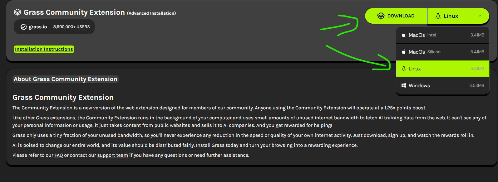
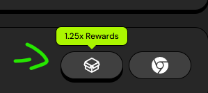
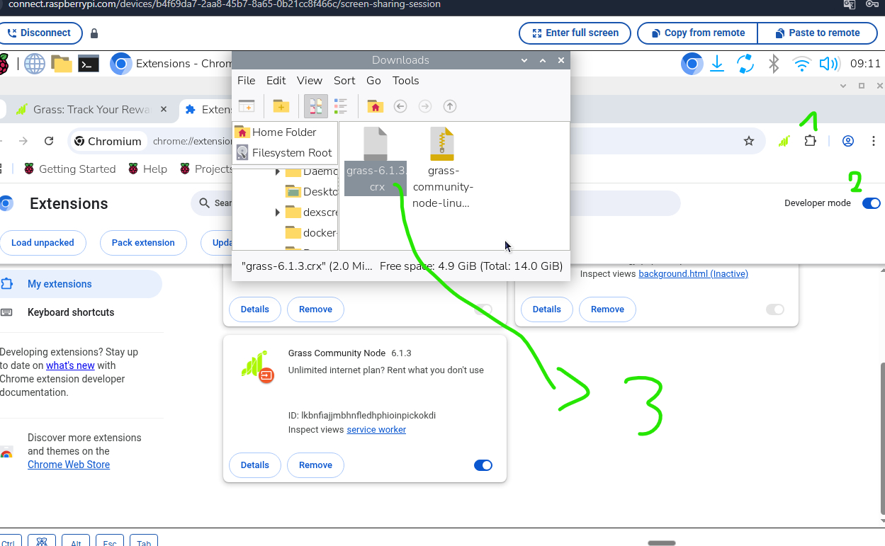
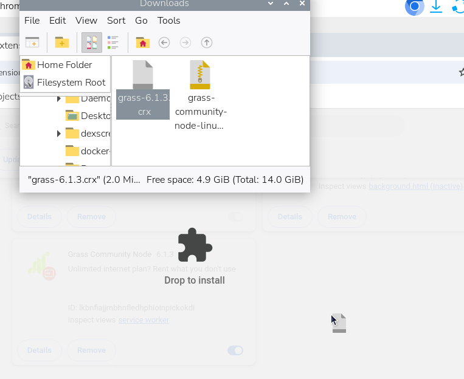
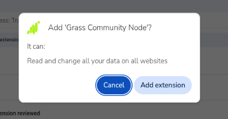
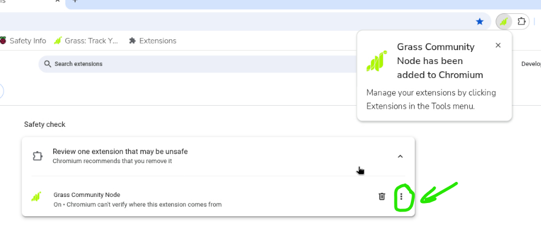
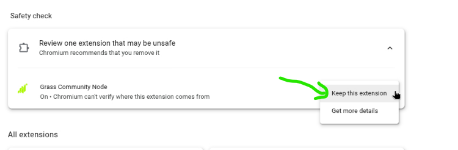
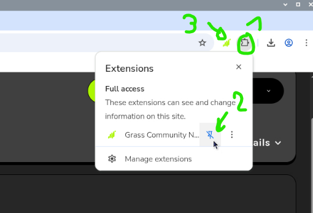
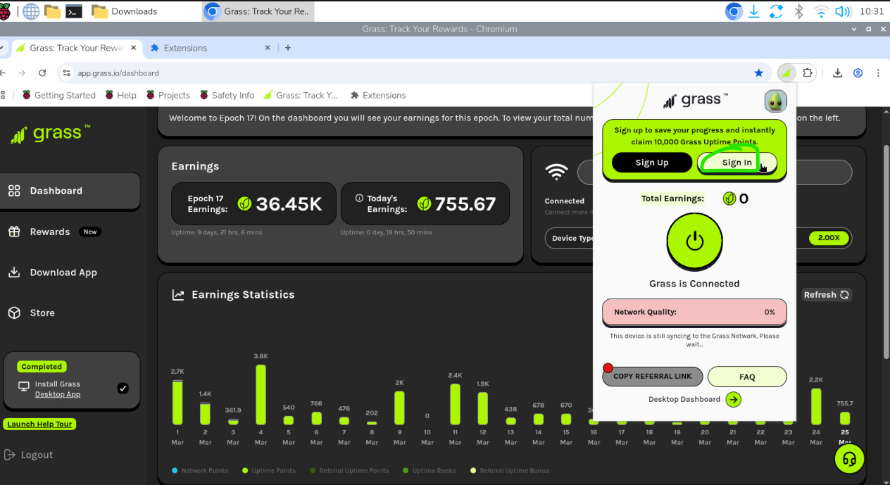
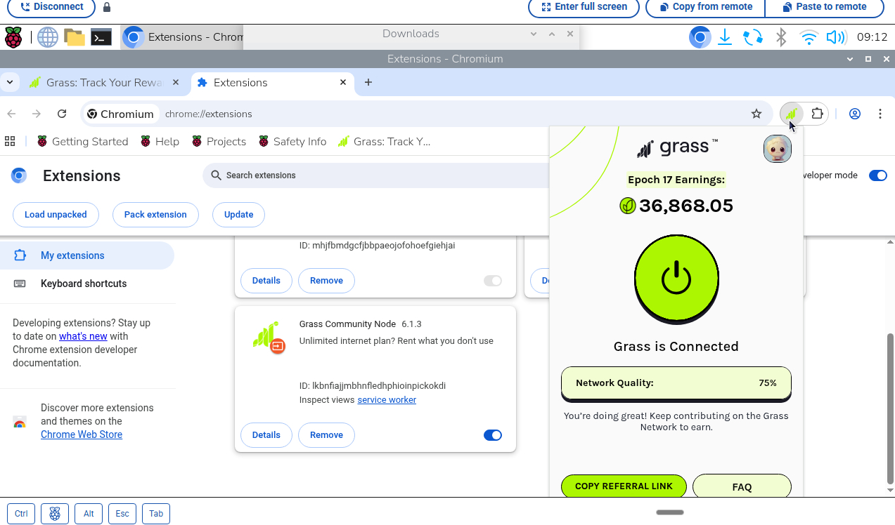

Raspberry Pi Connect Scripts 

---
## Instalacja Grass Node na Raspberry Pi (jako node)

1. Pobierasz wtyczke z [grass-linux](https://app.grass.io/dashboard/download/item/extension)




2. Dodajesz wtyczke do chromium:


   
 
   
   
   
   
   
...logujesz do panelu


Pobierz i uruchom skrypt instalacyjny jednym poleceniem:

```bash
curl -L https://raw.githubusercontent.com/hattimon/rpi-connect/main/grass-node/setup-grass.sh | bash
```

Restartujesz urządzenie:
```bash
sudo reboot
```


GOTOWE!
Automatycznie przy starcie startuje chromium z wtyczką grass w tle.

