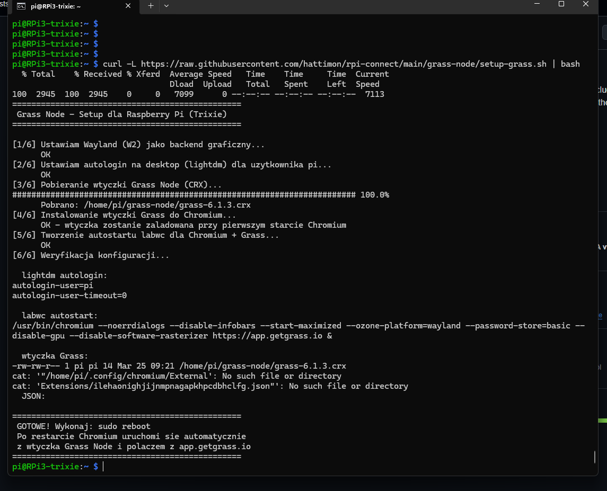

Raspberry Pi Connect Scripts 

---
## Instalacja Grass Node na Raspberry Pi (jako node)

Pobierz i uruchom skrypt instalacyjny jednym poleceniem:

```bash
curl -L https://raw.githubusercontent.com/hattimon/rpi-connect/main/grass-node/setup-grass.sh | bash
```



